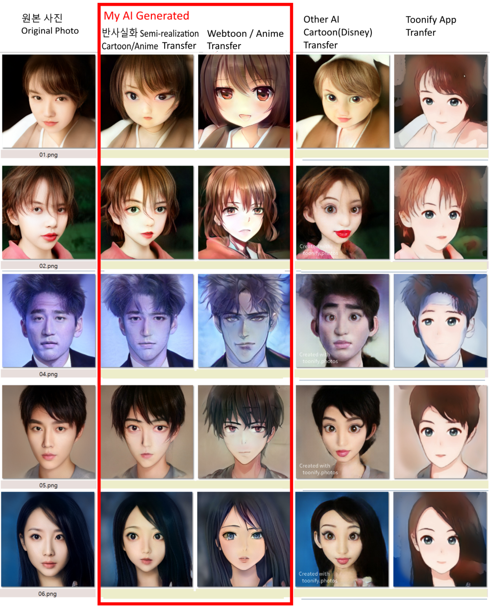
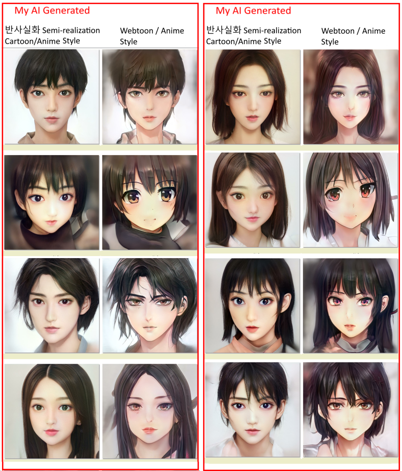
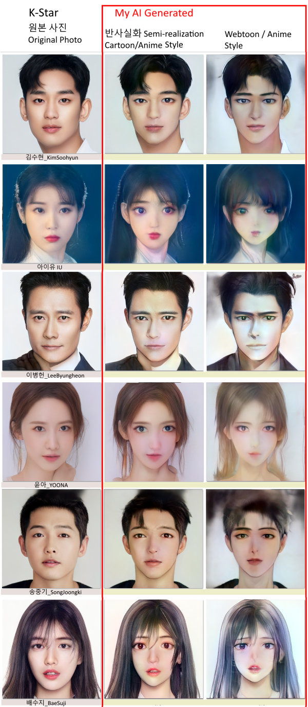

## StyleGAN2 Webtoon / Anime Style Toonify 

Korea Webtoon or Japanese Anime Character   
Stylegan2 base high Quality 1024x1024 / 512x512  Generate and Transfer  

Korean language
Stylegan2 를 이용해 고화질 반사실화 및 Webtoon / anime 스타일 캐릭터 생성 및 변환을 시도해 보았고 몇번의 시행착오 끝에 아래와 같이 만들 수 있었습니다.  
사람 얼굴 사진 Pretrained Model 에서 webtoon / anime 이미지 4백장정도로 Transfer Learning 과 Network blending 을 이용하였습니다.  
기존에 나온 것들은 서양 카툰 디즈니적이거나 반사실화적이지 않거나 동양적인 예쁜 케릭터가 잘 나오지 않아서 사실화같으면서 동양적 예쁘고 멋진 webtoon / anime 캐릭터가 나오는데 목적을 두었습니다.  
새로운 동양적이고 예쁜 고화질 캐릭터 생성도 잘 하지만 사람 얼굴 사진을  project 후 나온 latent vectors 를 이용해 이를 새로운 훈련된 모델로 generate 하여 photo face to toon/anime face 로 변환하였습니다.    
아직 미숙한 점도 있지만 단순 생성, 변환만이 아니고 latent vectors 를 이용하여 얼굴 움직이기, 웃기, 화내기 등 표정 등도 변경 생성 가능하였습니다.  

이후에는 반대로 webtoon / anime 캐릭터 이미지를 사실적 photo로 변경하는 것과 얼굴뿐만 아니라 전체 몸을 생성, webtoon / anime 전체 화면을 생성해 보는 것을 해 보려 합니다. 시간이 되는대로...   
더 나아가서는 DALL-E, CLIP 를 이용하거나 이런 방식을 이용해 글을 통해  toon/anime 를 생성하는 것을 진행해보고 싶습니다.  
웹툰/애니메이션을 좋아하나 그림 솜씨는 없어도 
AI를 이용해서 원하는 캐릭터나 toon/anime 을 만들고 이를 움직이고 말이나 글을 통해서 만들수 있지 않을까. 말로 AI 에게 지시해서 만들어가는 tonn/anime 을 상상해 봅니다.

---------


English Language  
I tried creating and converting high-definition reflections and Webtoon/anime style characters using Stylegan2, and after several trials and errors, I was able to create it as follows.    
Transfer learning and network blending were used with about 400 webtoon / anime images with the human face photo Pretrained Model.    
The existing ones are Western Cartoon Disney, not reflective, or Asian pretty characters aren't well out, so the purpose is to come up with Asian pretty and cool webtoon/anime character.    
I am good at creating new Asian and pretty high-quality characters, but I used latent vectors that came out after projecting a human face photo and generated it as a new trained model and converted it to photo face to toon/anime face.    
Although there are still some inexperienced things, it was possible to change expressions such as facial movements, laughs, and anger using latent vectors as well as simple creation and transformation.    
    
Afterwards, I will try to change the webtoon / anime character image to a realistic photo, create not only the face but also the entire body, and create the webtoon / anime full screen. As time comes...    
Furthermore, I would like to proceed with creating toon/anime through text writing using DALL-E, CLIP, or using this method.    
I like webtoon/animation, but I don’t have any drawing skills.    
Wouldn't it be possible to create a character or toon/anime you want using AI, move it, and create it through words or writings? I imagine a toon/anime created by instructing AI in words.    


## Compare to Others


## Generate toon images 


## Transfer Korea Star Photos to toon Images 

   
## Edit Face 1(Latent direction move) 


## Edit Face 2(Latent direction move) 

   

----------------------

## Requirements

See StyleGAN2 Requirements

## Usage

1) align image

Copy real face photos in "data_test" directory.
It will save face croped and aligned images. 

```.bash
python align_images.py data_test data_img_aligned
```

2) project image

It will generate *.npy files and projected_image files in "data_project_gen" directory.
Make "pretrained_networks" directory.
Download pretrain network "https://drive.google.com/file/d/1-04v78_pI59M0IvhcKxsm3YhK2-plnbj/view?usp=drivesdk" and save in "pretrained_networks" directory.

```.bash
python project_images.py data_img_aligned data_project_gen --num-steps=1500 --network-pkl="pretrained_networks/generator_star-stylegan2-config-f.pkl" --tmp-dir="./tmp"
```

3) toonify

It will generate toonified image files in "data_project_gen" directory and It will add "_toon" to filename.
Download pretrain network "https://drive.google.com/file/d/1ENBelwQO-_HWFJk0cBzFvi86wPuYwxSz/view?usp=sharing" and save in "pretrained_networks" directory.
Download pretrain network "https://drive.google.com/file/d/1AO42jOsgAdWC1L4lgZzk2-FarniPeilp/view?usp=sharing" and save in "pretrained_networks" directory.
* send email won.wizard@gmail.com to download permission. 

Semi-realistic Toon
```.bash
python toonify_lnw.py --image_dir=data_project_gen --filename=_toon1.jpg --blendednet="pretrained_networks/wonwizard-bl-anistar-s30r64.pkl"
```

Drawing Toon
```.bash
python toonify_lnw.py --image_dir=data_project_gen --filename=_toon2.jpg --blendednet="pretrained_networks/wonwizard-bl-anistar-s120r128.pkl"
```

Based on nvidia StyleGAN2.   
이것들은 개인적으로만 사용가능하며 허가없이 대외적으로 사용할 수 없음.   
These are for personal use only and cannot be used externally without my permission.   

